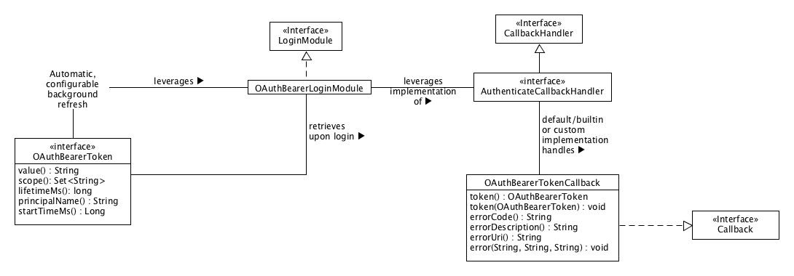

# bearer-auth

## Hassan Hamdan

- Deploy an Express server that implements Basic Authentication, with signup and signin capabilities

- Repository URL: https://github.com/HassanHamdanDev/bearer-auth

- Branch Name: dev

- PR : https://github.com/HassanHamdanDev/bearer-auth/pull/1

- HEROKU LINKS : https://hassan-bearer-auth.herokuapp.com/secret || users signin signup

- UML 

